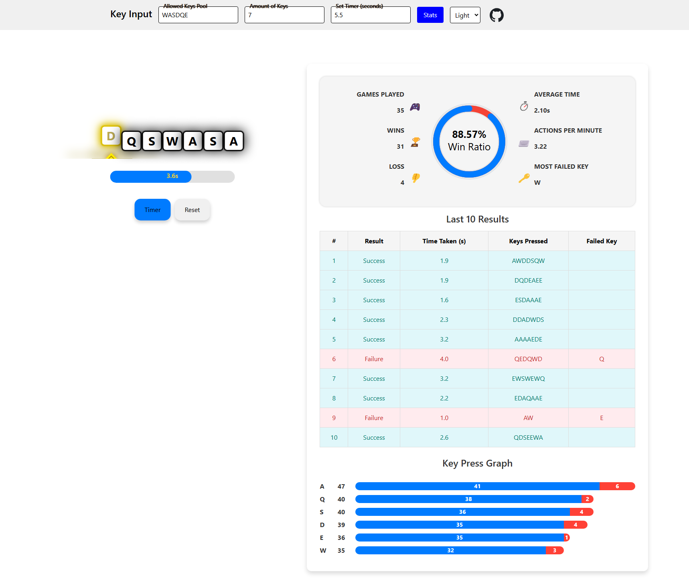

# Key Input

Mini-game inspired by Lost Ark. A simple key input where typing the correct sequence succeeds and any other key will result in a failure. Built with React components.

[Play the game here](https://paperpatch.github.io/key_input/)

## Table of Contents

* [Setup](#setup)
* [Usage](#usage)
* [Deployment](#deployment)
* [Contributing](#contributing)
* [License](#license)

## Setup
:floppy_disk:

The database uses the following package(s):
- [React](https://react.dev/)
  - The library for web and native user interfaces

## Usage

:computer:

If you cloned or copied the repository, ensure that you `npm install` to download the packages.

Start the server by typing `npm start`.

## Deployment

Server is deployed on github-pages. See deployed link to experience Key Input.

[Deployed link](https://paperpatch.github.io/key_input/)

## Contributing

:octocat:

[paperpatch](https://github.com/paperpatch)  

## License

:receipt:

No license available as of yet.